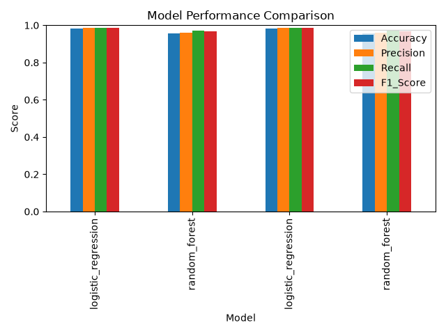
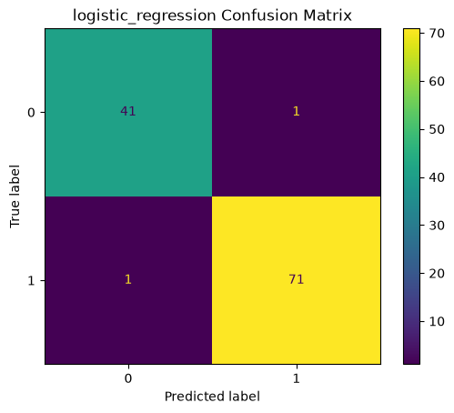
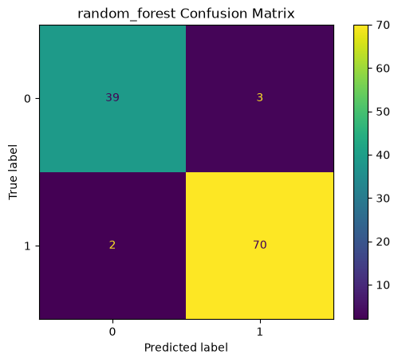
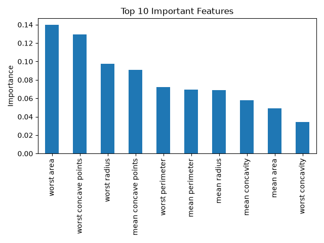

# Machine Learning Cancer Classifier

A Python-based machine learning application that classifies breast cancer samples using supervised learning techniques. This project implements a complete machine learning pipeline including data loading, preprocessing, model training, evaluation, visualization, and automated testing.

This project applies computer science and machine learning methods to biological data, combining my background in genetics with my interest in computational biology, data science, and software development.

---

## Motivation

This project explores how machine learning can be applied to biological classification problems.

By working with cancer diagnostic data, this project demonstrates practical implementation of:

- Data preprocessing
- Machine learning model development
- Model comparison
- Performance evaluation
- Data visualization
- Automated testing
- Modular software design

This project builds on my genetics background while developing practical skills in Python, machine learning, and data science.

---

## Dataset

This project uses the Breast Cancer Wisconsin Diagnostic Dataset provided through `scikit-learn`.

The dataset contains:

- 569 patient samples
- 30 numerical features
- Binary classification labels

Classification targets:

- `0` = malignant
- `1` = benign

Features describe characteristics of cell nuclei, including:

- Radius
- Texture
- Perimeter
- Area
- Smoothness
- Compactness
- Concavity
- Symmetry
- Fractal dimension

---

## Machine Learning Pipeline

The project follows a complete machine learning workflow:

1. Load biological dataset
2. Separate features and classification labels
3. Split data into training and testing sets
4. Standardize numerical features
5. Train classification models
6. Evaluate model performance
7. Generate visualizations
8. Export results

---

## Features

- Load and process biological classification data
- Split data into training and testing sets
- Standardize numerical features
- Train multiple machine learning models
- Compare model performance
- Calculate evaluation metrics
- Generate confusion matrices
- Visualize model comparison
- Identify important predictive features
- Export model performance results to CSV
- Automated testing with pytest

---

## Machine Learning Models

Two classification models were trained and evaluated.

### Logistic Regression

A linear classification model used as a baseline approach.

### Random Forest

An ensemble learning method that combines multiple decision trees to improve classification performance.

---

## Technologies Used

- Python 3
- pandas
- NumPy
- scikit-learn
- matplotlib
- pytest
- Git
- GitHub

---

## Project Structure

```text
ml-cancer-classifier/

├── images/
│   ├── feature_importance.png
│   ├── logistic_regression_confusion_matrix.png
│   ├── model_comparison.png
│   └── random_forest_confusion_matrix.png
│
├── results/
│   └── model_metrics.csv
│
├── src/
│   ├── data_loader.py
│   ├── evaluate.py
│   ├── main.py
│   ├── preprocessing.py
│   ├── save_results.py
│   ├── train.py
│   └── visualize.py
│
├── tests/
│   └── test_pipeline.py
│
├── README.md
├── requirements.txt
└── .gitignore
```

---

## Installation

Clone the repository:

```bash
git clone https://github.com/alexandra-002/ml-cancer-classifier.git
```

Navigate into the project:

```bash
cd ml-cancer-classifier
```

Install dependencies:

```bash
pip install -r requirements.txt
```

---

## Usage

Run the complete machine learning pipeline:

```bash
py src/main.py
```

The program will:

- Load the dataset
- Split data into training and testing sets
- Scale features
- Train Logistic Regression and Random Forest models
- Evaluate model performance
- Save metrics to CSV
- Generate visualization outputs

Results are saved to:

```text
results/model_metrics.csv
```

Visualizations are saved to:

```text
images/
```

---

## Model Performance

Models were evaluated using:

- Accuracy
- Precision
- Recall
- F1 Score
- Confusion Matrix

Performance results:

| Model | Accuracy | Precision | Recall | F1 Score |
|---|---|---|---|---|
| Logistic Regression | 0.982 | 0.986 | 0.986 | 0.986 |
| Random Forest | 0.956 | 0.959 | 0.972 | 0.966 |

Logistic Regression achieved the highest overall performance on the test dataset.

---

## Visualizations

### Model Comparison



### Logistic Regression Confusion Matrix



### Random Forest Confusion Matrix



### Feature Importance



---

## Running Tests

Run the automated test suite:

```bash
py -m pytest
```

Example output:

```text
==================== test session starts ====================

collected 6 items

tests/test_pipeline.py ...... [100%]

6 passed
```

Tests verify:

- Dataset loading
- Data splitting
- Feature scaling
- Logistic Regression training
- Random Forest training
- Model evaluation

---

## Future Improvements

Potential future enhancements include:

- Add additional machine learning models
- Perform hyperparameter tuning
- Add cross-validation
- Add ROC curves and AUC metrics
- Create a prediction interface for new samples
- Add biological interpretation of important features
- Deploy the model using a web application

---

## Skills Demonstrated

This project demonstrates:

- Python programming
- Machine learning workflows
- Biological data analysis
- Data preprocessing
- Model training and evaluation
- Statistical performance analysis
- Data visualization
- Automated testing
- Modular software design
- Git version control
- Technical documentation

---

## Author

**Alexandra Sigmon**